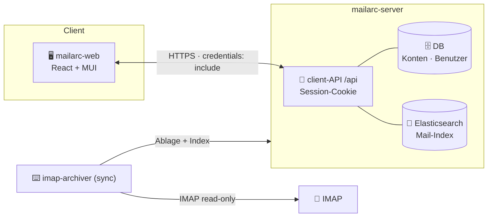

<div align="center">

# 📬 mailarc-web

**Professionelles React-Frontend für das `mailarc`-Mailarchiv**

Suche, Mail-Ansicht, PDF-Export, Statistik sowie Konten- & Benutzerverwaltung —
alles über die **client-API** des [`mailarc-server`](https://github.com/saggi1967/mailarc-server).

<br>

[](https://react.dev/)
[](https://www.typescriptlang.org/)
[](https://vite.dev/)
[](https://mui.com/)
[](https://tanstack.com/query)

[](https://github.com/saggi1967/mailarc-web)
[](https://github.com/saggi1967/mailarc-web/releases)
[](#-lizenz)

</div>

---

> [!NOTE]
> Der **IMAP-Import (`sync`)** bleibt bewusst **außerhalb** des UI (CLI/Cron).
> Das Frontend ist **lesend + verwaltend**: Suche, Mail-Ansicht, PDF, Anhänge,
> Statistik sowie Konten- & Benutzerverwaltung. Elasticsearch und die Datenbank
> bleiben serverseitig — der Client spricht ausschließlich `/api` (Session-Cookie).

## ✨ Funktionen

| | Funktion | Beschreibung |
|:--:|---|---|
| 🔎 | **Volltextsuche** | Server-seitig paginierte Ergebnisliste (MUI X DataGrid) über das gesamte Archiv |
| 🎛️ | **CLI-Filter im UI** | Zeitraum, Von/An, Domain, Betreff, Anhang-Name, Ordner, Phrase — identisch zur CLI |
| 🔗 | **Zustand in der URL** | Suche & Filter leben in der Adresszeile → „Zurück" erhält Treffer, Links sind teilbar |
| 📧 | **Mail-Ansicht** | Header, gerenderter Body und Anhangsliste einer einzelnen Nachricht |
| 📄 | **PDF-Export** | Serverseitig gerendertes PDF der Mail per Klick |
| 📎 | **Anhänge** | Auflisten und einzelner Download direkt aus der Detailansicht |
| 📊 | **Statistik-Dashboard** | Kennzahlen und Verteilungen aus `/api/stats/summary` |
| 🗂️ | **Kontenverwaltung** | Zentrale IMAP-Konten anlegen, ändern, löschen |
| 👥 | **Benutzerverwaltung** | Web-Benutzer & Rollen (nur **Admin**): anlegen, ändern, deaktivieren, löschen |
| 🔑 | **Passwort-Self-Service** | Jeder Benutzer ändert sein eigenes Passwort (mit Bestätigung des aktuellen) |
| 🛡️ | **Rollen-Gate** | Admin-Routen (`/users`) sind im Router und serverseitig geschützt |

## 🧱 Architektur



Der Client hält **kein Token im JavaScript** — Authentifizierung läuft über ein
`httpOnly`-Session-Cookie, jeder Request nutzt `credentials: "include"`.

## 🚀 Schnellstart

```bash
cp .env.example .env          # VITE_API_BASE auf den Server zeigen (z. B. http://localhost:9000)
npm install
npm run dev                   # → http://localhost:5173
```

Der **Server** muss die UI-Herkunft erlauben und einen Web-Login gesetzt haben:

```bash
# in der .env des mailarc-servers
WEB_USERNAME=admin
WEB_PASSWORD=<geheim>
WEB_ORIGINS=http://localhost:5173
ES_HOST=…   ES_USER=…   ES_PASSWORD=…   ES_INDEX=emails
```

> [!TIP]
> `VITE_API_BASE` (Client) und `WEB_ORIGINS` (Server) müssen zusammenpassen —
> sonst blockiert CORS die Cookie-basierten Requests.

## ⚙️ Konfiguration

| Variable | Ort | Zweck |
|---|---|---|
| `VITE_API_BASE` | `.env` (Client) | Basis-URL der client-API, z. B. `http://localhost:9000` |
| `WEB_ORIGINS` | Server | erlaubte CORS-Herkunft(en) der UI |
| `WEB_USERNAME` / `WEB_PASSWORD` | Server | Seed des ersten Admin-Logins |

## 📦 Skripte

| Befehl | Zweck |
|---|---|
| `npm run dev` | Dev-Server mit HMR |
| `npm run build` | Typecheck **+** Produktions-Build nach `dist/` |
| `npm run preview` | gebautes Bundle lokal ausliefern |
| `npm run typecheck` | nur TypeScript prüfen |

## 🗂️ Projektstruktur

```
src/
├── api/            client.ts (Fetch-Wrapper, credentials: include) + types.ts
├── auth/           AuthContext (Session laden, Login/Logout, isAdmin)
├── components/     Layout (AppBar + Benutzermenü) · ChangePasswordDialog
├── pages/          LoginPage · SearchPage · MailDetailPage
│                   DashboardPage · AccountsPage · UsersPage
├── theme.ts        MUI-Theme (Markenblau #2b6cb0)
├── App.tsx         Routing + Auth-Gate + Admin-Guard
└── main.tsx        Provider (Theme · QueryClient · Auth · Router)
```

## 🛠️ Tech-Stack

**Vite 6** · **React 18 + TypeScript 5.6** · **Material UI v6** + **MUI X DataGrid** ·
**TanStack Query 5** · **React Router 6**

## 🧭 Roadmap

Die nächsten Schritte drehen sich um **Mandantenfähigkeit** — die Auswahl zwischen
Konten und Ordnern innerhalb der Suche (**Phase M4**). Konzept & Gesamtplan liegen in
Confluence („mailarc-web & client-API" / Programm-Roadmap).

## 🔗 Verwandte Projekte

| Projekt | Rolle |
|---|---|
| [`mailarc-server`](https://github.com/saggi1967/mailarc-server) | zentraler Dienst: Konten, Ablage, client-API |
| [`imap-archiver`](https://github.com/saggi1967) | CLI: IMAP-Sync, Index-Zufuhr, PDF-Batch |

## 📄 Lizenz

Proprietär — © Microtronix. Interne Nutzung.
